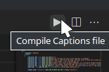

# Source Engine Support for Vscode

[](https://github.com/StefanH-AT/Source-Engine-VSCode-Extension/actions/workflows/test.yml)
[](https://github.com/dwyl/esta/issues)


<a href="https://github.com/StefanH-AT/Source-Engine-VSCode-Extension/graphs/contributors">

</a>

[Marketplace](https://marketplace.visualstudio.com/items?itemName=stefan-h-at.source-engine-support) - [Discord](https://discord.gg/BDDxkNwXWw) - [Bugs](https://github.com/StefanH-AT/Source-Engine-VSCode-Extension)

---

This extension adds intelligent syntax highlighting and additional tooling for Source Engine file formats.

## **Syntax highlighting**

Available for:

- KeyValue files 
  - .vdf .res .acf .kv .vmf .vmm .vmx
  - .txt files can be auto-detected as being KV files
- .vmt
- .fgd
- .qc
- .cfg
- lights.rad
- .vpc, .vgc
- .smd
- .fxc and _fxc.h


## **In-Editor compilation**

Instead of juggling standalone tools or CLI programs, simply **compile model (.qc) and captions (subtitles_english.txt)** right inside of the extension.



## **KeyValue file auto-detection**

In Source, many KeyValue files are saved with a `.txt` extension. Since not all .txt files should be treated as KeyValue files, this extension can auto-detect KeyValue files which end in `.txt`. 

> ⚠️ **This feature is disabled by default. A popup will ask you whether to turn this feature on the first time you open a .txt file.**

KV files are matched using a list of common keyvalue file names. (e.g.: gameinfo.txt, game_sounds_*.txt, subtitles_engish.txt...)

---

## Full feature list

Here's a list of all the things that are implemented in this extension

### General
- [x] KeyValue syntax highlighting
- [x] KeyValue semantic highlighting
- [x] Auto-detect common file names like gameinfo.txt
- [x] Semantic Tokenizer
- [x] Error detection
- [x] Duplicate key detection
- [x] Support for `#include` and `#base`
- [x] Support for conditionals (e.g.: `[$Debug]`)

### VMT
- [x] .vmt syntax highlighting
- [x] .vmt semantic highlighting with error detection and completions
- [x] Parameter name completion
- [x] Config for parameters
- [x] Parameter value completion
- [x] Parameter value validation dependent on parameter name
- [x] Texture (vtf) file path completion and missing file detection
- [x] Color value preview

### FGD
- [x] .fgd syntax highlighting
- [x] UnifyFGD syntax support (Hammer Addons)

### QC
- [x] QC syntax highlighting
- [x] Compile model button
  - [x] Configuration for mdlcompile.exe
  - [x] Configuration for game root path

### Captions
- [x] Captions syntax highlighting
- [x] Captions markup highlighting (I, B, clr tags...)
- [x] Captions color preview (clr tags)
- [x] In-editor Compile captions button

### CFG
- [x] .cfg syntax highlighting

### VPC
- [x] .vpc and .vgc syntax highlighting

### Lights.rad
- [x] .rad file syntax highlighting

### Soundscripts
- [x] Soundscript syntax highlighting
- [x] Soundscript snippets

### SMD
- [x] .smd syntax highlighting

### FXC
- [x] .fxc syntax highlighting
- [x] _fxc.h syntax highlighting (Shader header files)

---

## Sourcelib
This extension implements the features seen in [sourcelib](https://github.com/source-lib/sourcelib). 

## Contributing
This repository uses trunk based development, which means that all changes can be pushed straight to master. Every commit is automatically tested via the CI pipeline. Once a new version tag is pushed, the release is deployed. 

As an outside contributor, please create your pull requests to merge to the **master** branch. Do not edit changelog.md or the feature listings in readme.md as the changelog will be handled later when releasing.

Make sure all workflows succeed. To validate locally:
```
npm run lint
npm run test
```

## Compiling and testing locally
Users can just install this extension on the VSCode Marketplace, but developers might want to run the development build of the extension.

### Prerequisites
1) Install NPM and NodeJS (>v12)
2) Install Visual Studio Code (Duh)
3) Clone the repository
4) Run `npm install` in the repository's folder, to install the dependencies

### Testing
To start the unit tests, run `npm run test`. The project will be automatically compiled.

### Benchmarking
To run the benchmark tests, run `npm run benchmark`. The project will be automatically compiled

### Running the extension
1) To start the extension, first compile the project `npm run compile` (Or `npm run watch` to auto-compile on every file change)
2) Open the repository in VSCode
3) Open the 'Run and Debug' tab
4) Select the 'Extension' run configuration on the dropdown on the top
5) Run by pressing F5

## License
This project is licensed under the GNU Public License version 3: [License](LICENSE)
