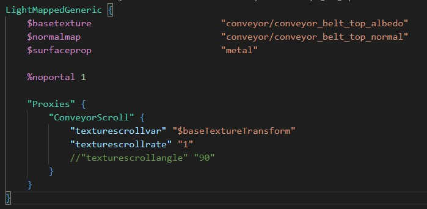

# Source Engine Support for Visual Studio Code

This extension adds intelligent support for Source Engine file types.

[Marketplace](https://marketplace.visualstudio.com/items?itemName=stefan-h-at.source-engine-support)

## Features
Checklist for features that are planned or already implemented.
### General
- [x] Keyvalue highlighting
- [x] Auto-detect common file names like gameinfo.txt

### VMT
- [x] VMT highlighting
- [x] Parameter name completion
- [x] Config for parameters

### FGD
- [x] .fgd highlighting
- [x] UnifyFGD support (Hammer Addons)

### Captions
- [x] Captions highlighting
- [x] Captions markup highlighting
- [x] Captions color preview

## Planned
This is what is planned for this extension. In case you wish to contribute, this is a good place to start.

### General
- [ ] Conditionals
- [ ] Tree view
- [ ] Schema implementation
  - Schema for gameinfo 
  - Schema for soundscripts
  - Schema for soundscapes

### VMT
- [ ] Parameter value completion
- [ ] Parameter value validation dependent on parameter name
- [ ] Texture path completion
- [ ] Color value preview

### QC
- [ ] QC highlighting
- [ ] QC smd/dmx path completion
- [ ] Compile model button
  - Configuration for mdlcompile.exe
  - Configuration for game root path

### VPC
- [ ] VPC highlighting
- [ ] $File path completion

### Captions
- [ ] Captions preview render
- [ ] Implement color preview for playerclr
- [ ] Ability to modify color in gui

## License
This project is licensed under the GNU Public License version 3: [License](LICENSE)

## Contribution
Contributions are welcome. Create a pull request!