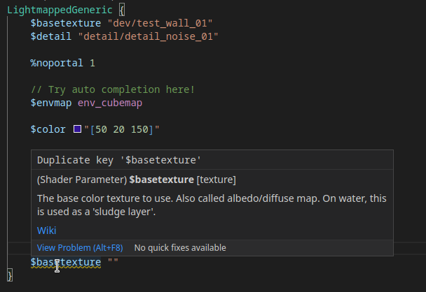

# Source Engine Support for Visual Studio Code

This extension adds intelligent support for Source Engine file types.

[Marketplace](https://marketplace.visualstudio.com/items?itemName=stefan-h-at.source-engine-support)

## Features
Checklist for features that are planned or already implemented.
### General
- [x] Keyvalue highlighting
- [x] Auto-detect common file names like gameinfo.txt
- [x] Semantic Tokenizer
- [x] Error detection

### VMT
- [x] VMT highlighting
- [x] Parameter name completion
- [x] Config for parameters
- [x] Parameter value completion
- [x] Parameter value validation dependent on parameter name
- [x] Texture path completion

### FGD
- [x] .fgd highlighting
- [x] UnifyFGD support (Hammer Addons)

### Captions
- [x] Captions highlighting
- [x] Captions markup highlighting
- [x] Captions color preview

## Planned
This is what is planned for this extension. In case you wish to contribute, this is a good place to start.

### General
- [ ] Conditionals
- [ ] Tree view
- [ ] Schema implementation
  - [ ] Schema for gameinfo 
  - [ ] Schema for soundscripts
  - [ ] Schema for soundscapes

### VMT
- [ ] Color value preview

### QC
- [ ] QC highlighting
- [ ] QC smd/dmx path completion
- [ ] Compile model button
  - [ ] Configuration for mdlcompile.exe
  - [ ] Configuration for game root path

### VPC
- [ ] VPC highlighting
- [ ] $File path completion

### Captions
- [ ] Captions preview render
- [ ] Implement color preview for playerclr
- [ ] Ability to modify color in gui
- [ ] Compile captions button

## Contribution
Contributions are welcome. Create a pull request!

## Compiling and testing locally
Users can just install this extension on the VSCode Marketplace, but developers might want to run the development build of the extension.

### Prerequisites
1) Install NPM and NodeJS (>v12)
2) Install Visual Studio Code (Duh)
3) Clone the repository
4) Run `npm install` in the repository's folder, to install the dependencies

### Testing
To start the unit tests, run `npm run test`. The project will automatically be compiled.

### Running the extension
1) To start the extension, first compile the project `npm run compile` (Or `npm run watch` to auto-compile on every file change)
2) Open the repository in VSCode
3) Open the 'Run and Debug' tab
4) Select the 'Extension' run configuration on the dropdown on the top
5) Run by pressing F5

## License
This project is licensed under the GNU Public License version 3: [License](LICENSE)
