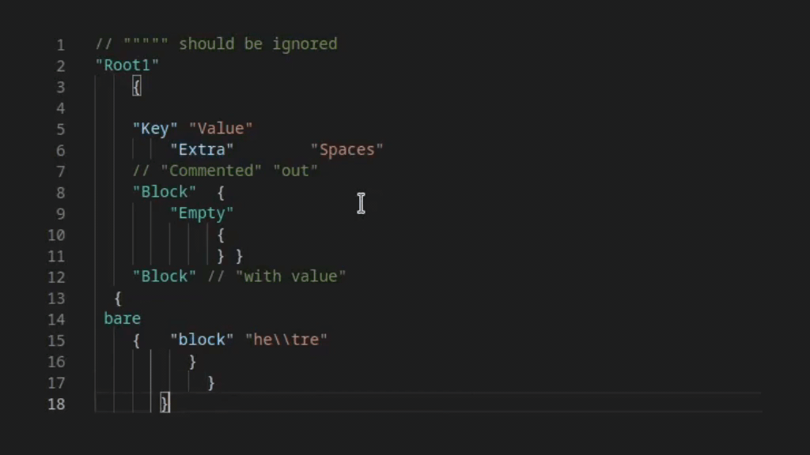

# Source Engine Support for Visual Studio Code

[](https://github.com/StefanH-AT/Source-Engine-VSCode-Extension/actions/workflows/test.yml)
[](https://github.com/dwyl/esta/issues)


<a href="https://github.com/StefanH-AT/Source-Engine-VSCode-Extension/graphs/contributors">

</a>

This extension adds intelligent support for Source Engine file types like VMT, QC, FGD, gameinfo.txt and many more.

[Marketplace](https://marketplace.visualstudio.com/items?itemName=stefan-h-at.source-engine-support) - [Discord](https://discord.gg/BDDxkNwXWw)




---

## Features
Checklist for features that are planned or already implemented.

### General
- [x] Keyvalue highlighting
- [x] Auto-detect common file names like gameinfo.txt
- [x] Semantic Tokenizer
- [x] Error detection
- [x] Duplicate key detection
- [x] Keyvalue file auto indentation and formatting
- [x] Support for `#include` and `#base`
- [x] Support for conditionals (e.g.: `[$Debug]`)

### VMT
- [x] VMT highlighting
- [x] Parameter name completion
- [x] Config for parameters
- [x] Parameter value completion
- [x] Parameter value validation dependent on parameter name
- [x] Texture path completion
- [x] Color value preview

### FGD
- [x] .fgd highlighting
- [x] UnifyFGD support (Hammer Addons)

### QC
- [x] QC highlighting
- [x] Compile model button
  - [x] Configuration for mdlcompile.exe
  - [x] Configuration for game root path

### Captions
- [x] Captions highlighting
- [x] Captions markup highlighting
- [x] Captions color preview
- [x] Compile captions button

### CFG
- [x] .cfg highlighting

### VPC
- [x] VPC highlighting

### Lights.rad
- [x] .rad file highlighting

### Soundscripts
- [x] Soundscript snippets

### SMD
- [x] .smd highlighting

## Planned
This is what is planned for this extension. In case you wish to contribute, this is a good place to start.

### General
- [ ] Tree view
- [ ] Schema implementation
  - [ ] Schema for gameinfo 
  - [ ] Schema for soundscripts
  - [ ] Schema for soundscapes

### QC
- [ ] QC smd/dmx path completion

### VPC
- [ ] $File path completion

### Captions
- [ ] Captions preview render
- [ ] Ability to modify color in gui

---

## Contribution
Create your pull requests to merge to the **dev** branch. Do not edit changelog.md or the feature listings in readme.md as the changelog will be handled later when merging to master.

Make sure all workflows succeed. To validate locally:
```
npm run lint
npm run test
```

## Compiling and testing locally
Users can just install this extension on the VSCode Marketplace, but developers might want to run the development build of the extension.

### Prerequisites
1) Install NPM and NodeJS (>v12)
2) Install Visual Studio Code (Duh)
3) Clone the repository
4) Run `npm install` in the repository's folder, to install the dependencies

### Testing
To start the unit tests, run `npm run test`. The project will automatically be compiled.

### Running the extension
1) To start the extension, first compile the project `npm run compile` (Or `npm run watch` to auto-compile on every file change)
2) Open the repository in VSCode
3) Open the 'Run and Debug' tab
4) Select the 'Extension' run configuration on the dropdown on the top
5) Run by pressing F5

## License
This project is licensed under the GNU Public License version 3: [License](LICENSE)
